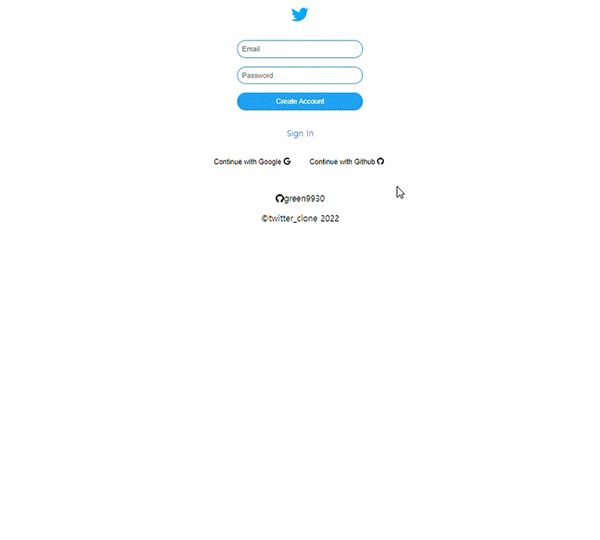
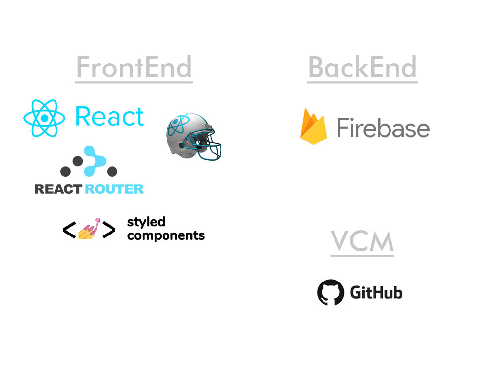

# twitter clone
  
배포  |  [Go to twitter clone](https://green9930.github.io/twitter-clone/)  
  
    
  
   
  
  
## 기획 의도
  
- 트위터의 주요 기능을 클론 코딩한 웹 어플리케이션을 제작하고자 했습니다.
- firebase v9를 활용하여 회원 관리 기능을 구현하고자 했습니다.
  
  
## 주요 기능
  
- 로그인 및 회원가입 기능 : firebase authentication를 활용하여 로그인, 회원가입 및 회원 관리 기능을 구현했습니다.
- 사용자 이름 수정 기능 : 소셜 회원가입의 경우 계정에 등록된 이름으로 초기 이름이 설정되고, 이메일로 회원가입한 경우 초기 이름이 'User'로 설정됩니다. 이름은 profile에서 변경할 수 있습니다.
- 트위터 열람 기능 : 사용자 본인 뿐만 아니라 다른 회원의 멘션도 열람할 수 있습니다. 
- 트위터 작성/수정/삭제 기능 : 사용자 본인이 작성한 멘션은 수정하거나 삭제할 수 있습니다. 또한 원하는 사진도 함께 업로드하여 멘션을 작성할 수 있습니다.
  
    
## 기술 스택
    

